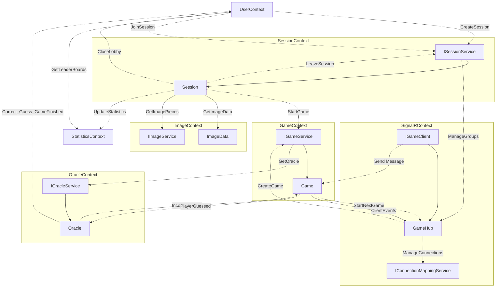
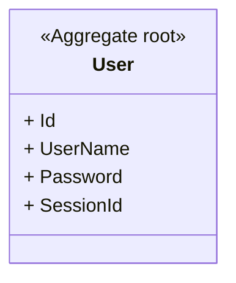
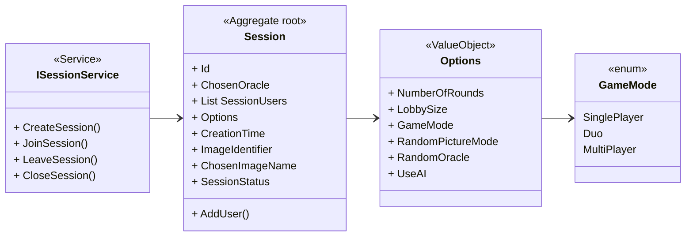
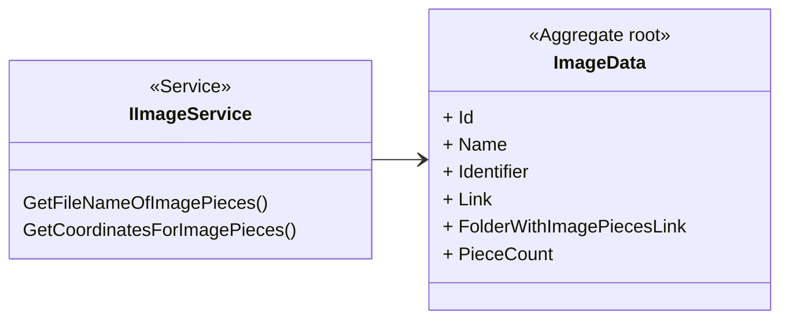
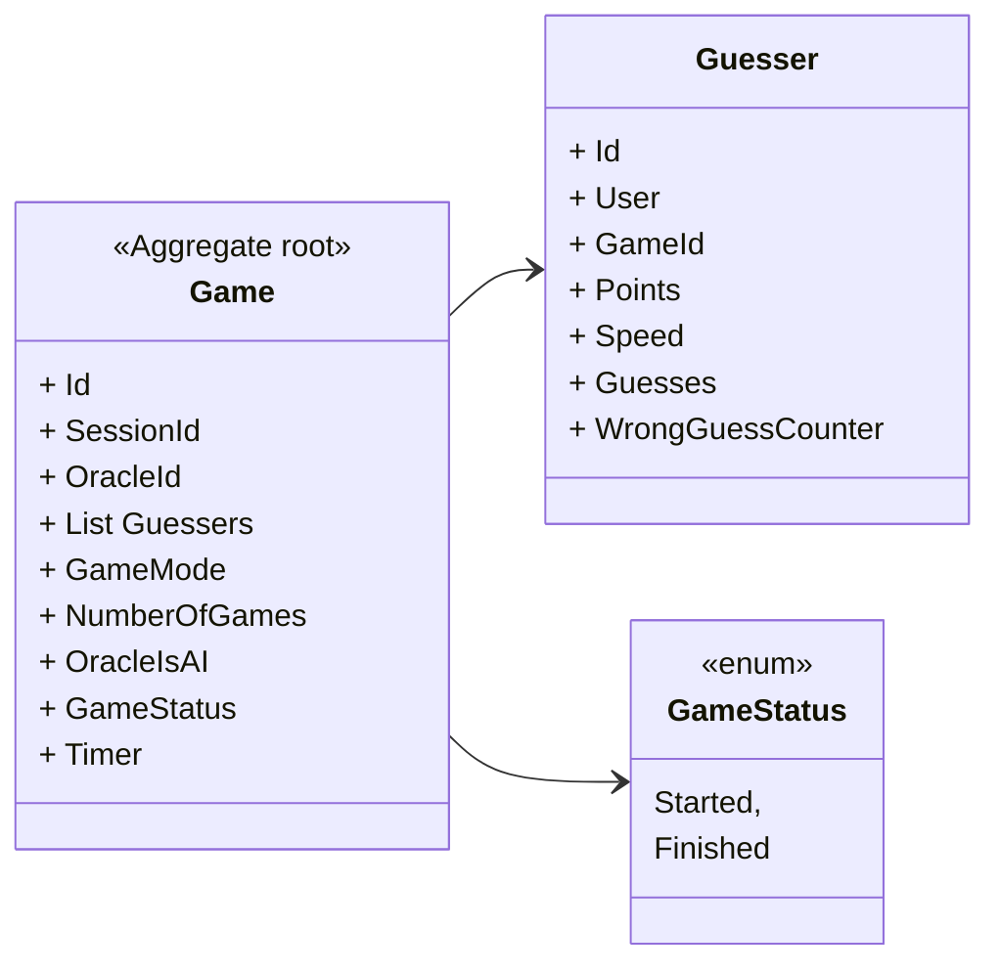
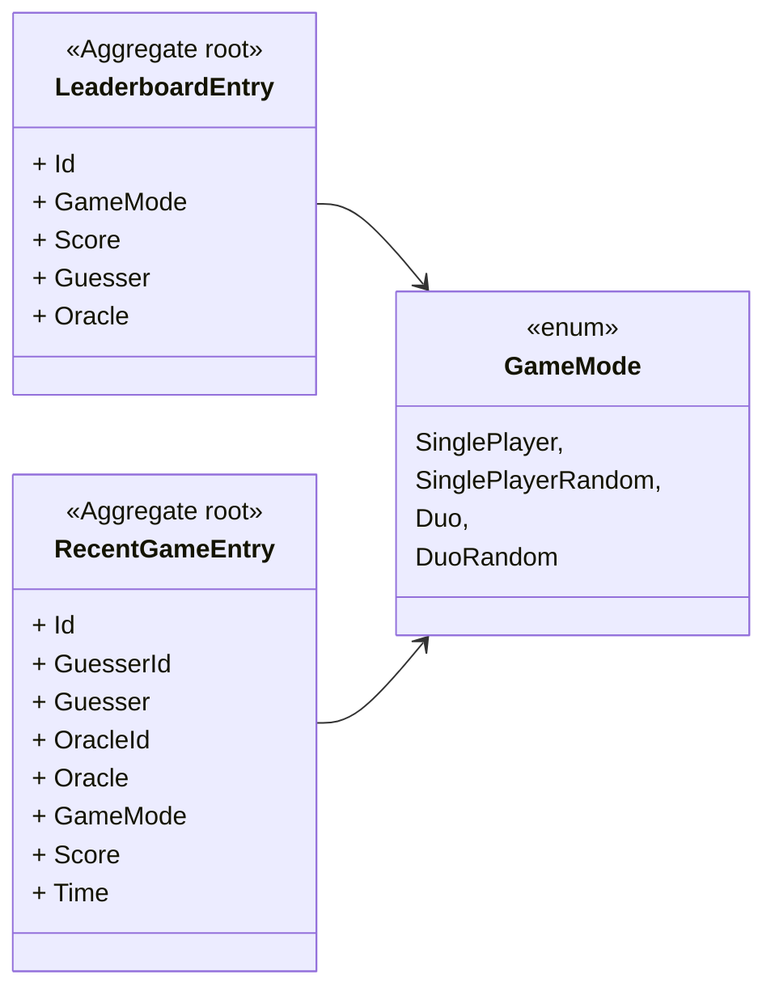
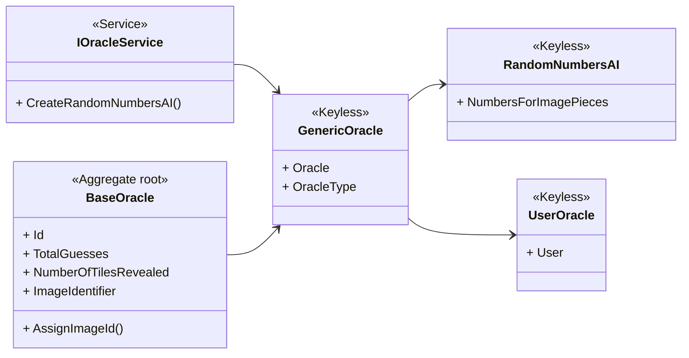
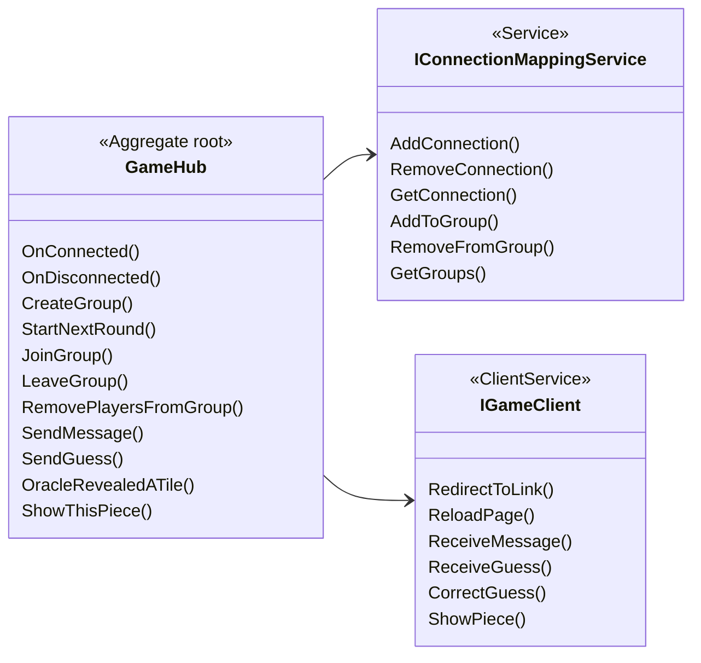

# Relations between modules and contexts

## Flow Chart

## Contexts

### UserContext 

### Session context

### Image Context

### Game Context

### Statistics context

### Oracle Context

### SignalRContext

## Concept thoughts

#### Design / Development philosophy
Keep developing with the intent for all Advanced features to be implemented.  
Decouple as much code as possible, keep all get/set/edit/delete for any database items in their separate pipeline files.  
If repeated code segments are used multiple places through out the codebase consider turing it into a generic function if possible.  

#### Features we think of implementing not mentioned in the readme
An additional game mode where random pictures are used in the game rather than a selected one. See leaderboard for more. 
Private Lobbies (Accessed by a hotlink?) 
Random / Selected Oracle 

#### User Login
User should be able to login or register into an account. 

#### Lobby Context
Having options that are available to the Oracle of the session.  
Initial thoughts for different options:
<ul>
    <li>Random Oracle / Selected Oracle</li>
    <li>Random Image</li>
    <li>Lobby size</li>
    <li>Private Lobby</li>
    <li>Numbers of rounds (if this is implemented)</li>
</ul>

#### Leaderboards
Leaderboards should be shown at the login and front page. Initial thought is to differentiate leaderboards by buttons at the top of the leaderboard. 

Proposing 2 different leaderboards:
<ul>
    <li>Multiplayer</li>
    <li>SinglePlayer</li>
</ul>

The random Leaderboards are for tracking players who choose to have a picture chosen at random, this is not a mandatory feature so we'll look into it later.

Instead a having so many different leaderboards, two leaderboards with the Mode field should clarify what was chosen in that game.

#### Recent games
Displays a table of the last 3-5 games for currently logged in user.

#### AddImage
Takes in a bool 
If its True ImageContext chooses an Image randomly 
If its False an ImageContext sends a selection of all images for 
oracle(Player) to choose from. 

### Oracle Context
The Oracle can either be an AI or a Player. The different random AIs are created by mixing the Image pieces randomly and in the game th AI increment through the tiles. If a player is the oracle, they can freely choose which tile they want to reveal. The Oracle keeps track of how many guesses were made during the game. 

#### SinglePlayer Oracle (Trained AI????) IS Lobby size 1 and Private
When there is no session available, a single player can play against a random oracle which selects a set of random segments incrementally. Then ask the same player to propose better segments. These segments would be pre-recorded for future Guessers. 

### Game Context
The main context of the game, has a lot of different functions and events. The CreateNewAI event takes in an Image (requested from the ImageContext) with its initial properties of the class like for example the ImagePieces. The User can either join or create a session/game. Add the desired players, and start the game when players are ready.

#### The game itself
Switch between players guessing and oracle as an AI or player reveals the tiles one by one. Its only oracles turn if the guesser/s give up or they exceed the Wrong guess Counter of 3 in a row. 

#### Join a session
If the User wants to join a Lobby that is public and has room for more players, then he/she should be able to do just that.  

#### How a game ends
The game ends if a Guesser is successfully able to guess the name of the picture, or if all segments are opened, or if the Guesser/s decides to quit. 

